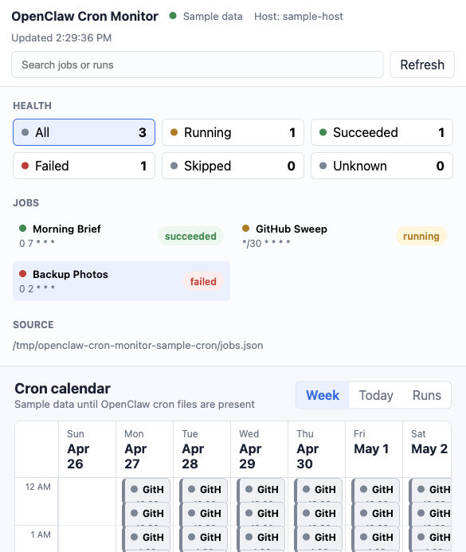

# OpenClaw Cron Monitor

Read-only web dashboard and OpenClaw/Pi package for monitoring cron jobs and recurring task runs.

The monitor reads local OpenClaw cron files, projects upcoming cron occurrences into a week calendar, and lets you inspect recent run history, logs, delivery status, model/session settings, and timeout values. It does not edit jobs.



## Recent Changes

- Added an Owner / Session filter so jobs can be scoped by bot, session, or isolated cron ownership.
- Health counts, the job list, the calendar, and the runs table now update together when owner, status, or search filters are active.
- Fixed the Today calendar view so it renders as a full-width single day instead of a narrow week column.
- Fixed search focus retention so typing a full search term does not require re-clicking the search box after each letter.
- Updated deployment guidance to keep the dashboard bound to `127.0.0.1` and expose remote access through Tailscale Serve, SSH tunnels, or another authenticated private-network proxy.

## Install The Web Dashboard

```bash
npm install -g openclaw-cron-monitor
openclaw-cron-monitor
```

Or run from a checkout:

```bash
npm start
```

Then open:

```text
http://localhost:3817
```

## Install As An OpenClaw/Pi Package

From npm:

```bash
pi install npm:openclaw-cron-monitor@0.1.0
```

From a git repository:

```bash
pi install git:github.com/<your-github-username>/openclaw-cron-monitor@v0.1.0
```

From a local checkout:

```bash
pi install /path/to/openclaw-cron-monitor
```

After installation, OpenClaw/Pi loads the package extension declared in `package.json`:

```json
{
  "pi": {
    "extensions": ["./extensions"]
  }
}
```

The package registers read-only tools:

- `cron_monitor_overview`: returns normalized cron jobs, health counts, and optional projected calendar events.
- `cron_monitor_runs`: returns recent run records for one job id.
- `/cron-monitor`: shows the local dashboard launch hint.

The package also includes `openclaw.plugin.json` for runtimes that discover plugin metadata directly.

## Configuration

Defaults:

- `OPENCLAW_CRON_DIR=~/.openclaw/cron`
- `OPENCLAW_JOBS_PATH=$OPENCLAW_CRON_DIR/jobs.json`
- `OPENCLAW_STATE_PATH=$OPENCLAW_CRON_DIR/jobs-state.json`
- `OPENCLAW_RUNS_DIR=$OPENCLAW_CRON_DIR/runs`
- `HOST=127.0.0.1`
- `PORT=3817`
- `OPENCLAW_MONITOR_NETWORK_LABEL=Private network`
- `OPENCLAW_MONITOR_HOST_LABEL=<system hostname>`

Example:

```bash
OPENCLAW_MONITOR_NETWORK_LABEL="Tailscale Serve" OPENCLAW_MONITOR_HOST_LABEL="cron-host" HOST=127.0.0.1 PORT=3817 openclaw-cron-monitor
```

Keep `HOST=127.0.0.1` for the dashboard process unless you have a specific reason to bind elsewhere. For access from other trusted devices, put the localhost service behind a private-network proxy such as Tailscale Serve:

```bash
tailscale serve --http=3817 127.0.0.1:3817
```

This keeps the unauthenticated read-only dashboard off the general LAN while still making it reachable to devices signed into your tailnet. If you choose a direct bind instead, prefer the host's Tailscale IP over `0.0.0.0`.

## Registry Checklist

Before publishing:

1. Replace placeholder repository references with the real public repository.
2. Run `npm run check`.
3. Run `npm pack --dry-run` and verify the file list.
4. Confirm the package contains no local cron data, run logs, hostnames, network addresses, or user-specific paths.
5. Publish to npm or tag a git release.

## Privacy

The package contains no cron job data, run logs, hostnames, private network addresses, or user-specific paths. Runtime data is read from the machine where the monitor is installed and is only served by the local process you start.

For private-network deployments, keep the monitor bound to `127.0.0.1` and expose it through Tailscale Serve, an SSH tunnel, or another authenticated private-network proxy. Avoid binding the monitor to `0.0.0.0` unless you have also added access control in front of it.
